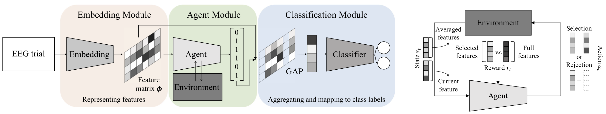

## A Novel RL-Assisted Deep Learning Framework for Task-Informative Signals Selection and Classification for Spontaneous BCIs
<p align="center"></p>

This repository provides a TensorFlow implementation of the following paper:
> **A Novel RL-Assisted Deep Learning Framework for Task-Informative Signals Selection and Classification for Spontaneous BCIs**<br>
> [Wonjun Ko](https://scholar.google.com/citations?user=Fvzg1_sAAAAJ&hl=ko&oi=ao)<sup>1</sup>, [Eunjin Jeon](https://scholar.google.com/citations?user=U_hg5B0AAAAJ&hl=ko)<sup>1</sup>, and [Heung-Il Suk](https://scholar.google.co.kr/citations?user=dl_oZLwAAAAJ&hl=ko)<sup>1, 2</sup><br/>
> (<sup>1</sup>Department of Brain and Cognitive Engineering, Korea University) <br/>
> (<sup>2</sup>Department of Artificial Intelligence, Korea University) <br/>
> Official Version: https://ieeexplore.ieee.org/abstract/document/9293035 <br/>
> Published in IEEE Transactions on Industrial Informatics (2020-JCR-IF: 10.215, Engineering-Industrial: 1/49)
> 
> **Abstract:** *In this article, we formulate the problem of estimating and selecting task-relevant temporal signal segments from a single electroencephalogram (EEG) trial in the form of a Markov decision process and propose a novel reinforcement-learning mechanism that can be combined with the existing deep-learning-based brain–computer interface methods. To be specific, we devise an actor–critic network such that an agent can determine which timepoints need to be used (informative) or discarded (uninformative) in composing the intention-related features in a given trial, and thus enhancing the intention identification performance. To validate the effectiveness of our proposed method, we conduct experiments with a publicly available big motor imagery (MI) dataset and apply our novel mechanism to various recent deep-learning architectures designed for MI classification. Based on the exhaustive experiments, we observe that our proposed method helped achieve statistically significant improvements in performance.*

## Dependencies
* [Python 3.6+](https://www.continuum.io/downloads)
* [TensorFlow 2.0.0+](https://www.tensorflow.org/)

## Downloading datasets
To download KU-MI dataset
* http://gigadb.org/dataset/100542

## Citation
If you find this work useful for your research, please cite our [paper](https://ieeexplore.ieee.org/abstract/document/9293035):
```
@article{ko2020novel,
  title={A novel {RL}-assisted deep learning framework for task-informative signals selection and classification for spontaneous {BCI}s},
  author={Ko, Wonjun and Jeon, Eunjin and Suk, Heung-Il},
  journal={IEEE Transactions on Industrial Informatics},
  volume={18},
  number={3},
  pages={1873--1882},
  year={2022},
  publisher={IEEE}
}
```

## Acknowledgements
This work was supported by Institute for Information & Communications Technology Promotion (IITP) grant funded by the Korea government under Grant 2017-0-00451 (Development of BCI based Brain and Cognitive Computing Technology for Recognizing User’s Intentions using Deep Learning) and Grant 2019-0-00079 (Department of Artificial Intelligence, Korea University).
